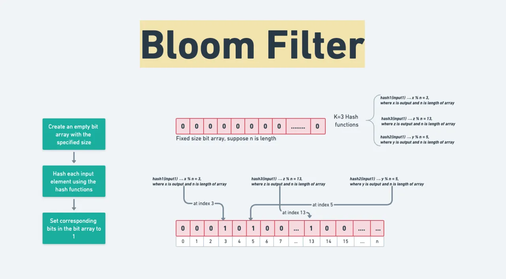
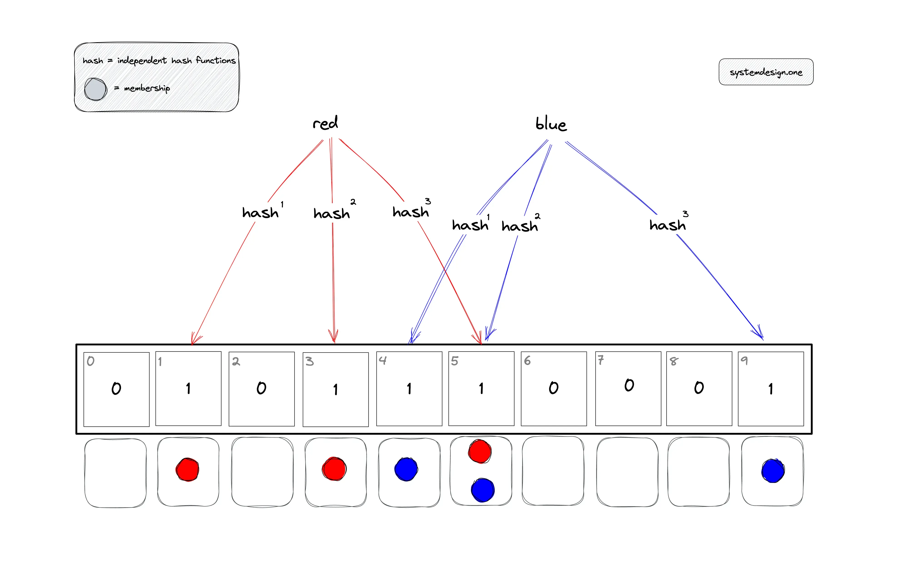

### 🌸 What is a Bloom Filter? (Simple English)

A **Bloom Filter** is a **probabilistic data structure** used to check whether an element is **possibly present** in a set or **definitely not present**.

👉 It answers:

* **“Is this item maybe present?”**
* **“Or is it definitely not present?”**

⚠️ Important points:

* ❌ **False positives are possible** → It may say “present” even if the item is not there
* ✅ **False negatives never happen** → If it says “not present,” it is guaranteed not present

📌 Because of this behavior, Bloom Filters are mainly used as a **fast pre-check** before hitting the database.

---

## 🔍 Real-life Example

Imagine you have **10 million users** in your database.

* Querying the database for every request → ❌ slow
* First checking with a Bloom Filter → ✅ very fast

Flow:

```
Request → Bloom Filter → (Maybe Yes) → Database Query
                     → (No) → Direct Reject
```

---

## 📦 Common Use-Cases of Bloom Filters

* Checking duplicate emails or usernames
* Preventing cache penetration
* Fraud detection systems
* API rate limiting
* Large-scale systems (used in Redis, Cassandra, BigTable, etc.)

---

## ⚙️ How a Bloom Filter Works (Conceptually)

* Uses a **bit array**
* Uses **multiple hash functions**
* Each inserted item sets multiple bits to `1`

---

# 🟢 Using Bloom Filter in Node.js

### 📥 Installation

```bash
npm install bloom-filters
```

### 📌 Basic Example (Duplicate Email Check)

```js
const { BloomFilter } = require('bloom-filters')

// 100,000 items with 1% false positive rate
const filter = BloomFilter.create(100000, 0.01)

filter.add("test@gmail.com")

console.log(filter.has("test@gmail.com"))   // true
console.log(filter.has("fake@gmail.com"))   // false or maybe true
```

---

## 🟢 Node.js + PostgreSQL (Best Practice)

```js
async function isEmailAvailable(email) {
  if (!filter.has(email)) {
    return true // definitely not in DB
  }

  // maybe present → confirm from DB
  const user = await pg.query(
    "SELECT id FROM users WHERE email=$1",
    [email]
  )

  return user.rowCount === 0
}
```

📌 Benefit:

* Saves **80–90% database queries**

---

## 🟢 Node.js + MongoDB

```js
async function checkUser(email) {
  if (!filter.has(email)) return false

  return await users.findOne({ email })
}
```

---

# 🐍 Using Bloom Filter in Python

### 📥 Installation

```bash
pip install pybloom-live
```

### 📌 Basic Example

```python
from pybloom_live import BloomFilter

bf = BloomFilter(capacity=100000, error_rate=0.01)

bf.add("test@gmail.com")

print("test@gmail.com" in bf)   # True
print("fake@gmail.com" in bf)   # False or maybe True
```

---

## 🐍 Python + PostgreSQL

```python
def is_email_available(email):
    if email not in bf:
        return True

    cur.execute("SELECT id FROM users WHERE email=%s", (email,))
    return cur.fetchone() is None
```

---

## 🐍 Python + MongoDB

```python
def user_exists(email):
    if email not in bf:
        return False

    return users.find_one({"email": email}) is not None
```

---

# 🧠 Production Architecture





### 🔥 Typical Production Flow

```
Client
  ↓
Bloom Filter (In-Memory / Redis)
  ↓ maybe
Database (PostgreSQL / MongoDB)
```

---

## 🚀 Advanced Notes (Industry-Level)

### 1️⃣ Redis Bloom (Recommended for Distributed Systems)

Redis provides a Bloom Filter module:

```bash
BF.ADD users test@gmail.com
BF.EXISTS users test@gmail.com
```

### 2️⃣ Application Restart Issue

* In-memory Bloom Filters are cleared on restart
* Solutions:

  * Use Redis Bloom
  * Rebuild the Bloom Filter from the database at startup

### 3️⃣ When NOT to Use a Bloom Filter

❌ When **100% accuracy** is required
❌ When frequent deletions are needed (unless using a Counting Bloom Filter)

---

## 📊 PostgreSQL vs MongoDB with Bloom Filter

| Database   | How Bloom Filter Helps           |
| ---------- | -------------------------------- |
| PostgreSQL | Pre-check before indexed queries |
| MongoDB    | Duplicate document detection     |
| Both       | Prevent cache penetration        |

---

## ✅ Interview-Ready Summary

> **A Bloom Filter is a fast, memory-efficient probabilistic data structure that tells whether an element is definitely not present or maybe present. It is mainly used to reduce unnecessary database queries.**

If you want next:

* Redis Bloom hands-on
* System design interview example
* Counting Bloom Filter (supports delete)

Just tell me 👍
